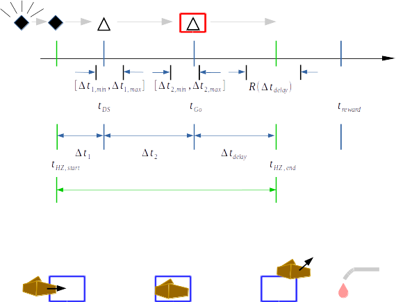
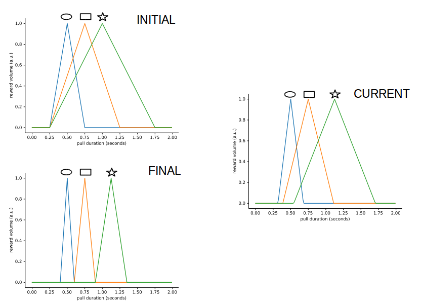

# Non-human Primate Interval Timing Task

## Homezone Exit task correct trial sequence

Above: the series of animal-initiated events (green vertical markers), task-generated events  (blue vertical markers) and  measured intervals (horizontal arrows) during a correct trial of the homezone exit task.  The trial begins when on hand entry into the homezone target.  After a random interval of time between two user-specified limits $[\Delta t_{1, min}, \Delta t_{1, max}]$, a place-holder visual stimulus (triangle) is shown on the screen at $t_{DS}$.  The animal is cued to move its hand out of the homezone on appearance of a "Go" cue presented at $t_{Go}$; the Go cue takes the form of a red box that surrounds the discriminative stimulus already present on the screen.  If hand exit occurs within a user-specified limit a liquid reward is subsequently delivered, the volume of which scales as linearly-downward function dependent on $\Delta t_{delay}$.

Relevant parameters in `MonkeyImages_Joystick_Conf.py` as well as their corresponding key name and value(s) to load from configuration file, to setup "Homezone Exit" version of task:

- Version of task to run `TaskType`-> `Task Type`: `HomezoneExit`
- Graphics files directory path for task-specific visual stimuli: `source` -> `Path To Graphics Dir`: `"./TaskImages_HomezoneExit/"` (loads single triangle discriminative stimulus).
- Number of unique intervals and relevant disciminative stimuli to setup in task: `NumEvents` -> `Number of Events`: `1`.
- `RewardClass(*Ranges)` -> `Ranges`: `1, 0.0, 3.0` (Function call to generate the single linear peak function for the sole discriminative stimulus (a triangle).  Description of each value in `Ranges` can be found in [Reward](#Reward) section below.)

## Joystick Pull Task correct trial sequence

Above: the series of animal-initiated events (green vertical markers), task-generated events  (blue vertical markers) and  measured intervals (horizontal arrows) during a correct trial of the interval timing task. After a random interval of time between two user-specified limits $[\Delta t_{1, min}, \Delta t_{1, max}]$, one of several possible discriminative stimuli is shown on the screen at $t_{DS}$; discriminative stimuli are geometric shapes that each code for a particular desired pull duration that the animal will be rewarded for producing later subsequently during the trial.  The animal is cued to start a joystick pull on the appearance of a "Go" cue presented at $t_{Go}$; the Go cue takes the form of a red box that surrounds the discriminative stimulus already present on the screen.  If the animal produces a joystick pull response of duration that falls within a user-specified time interval, a liquid reward is subsequently delivered, the volume of which scales as a bi-directional, linearly-dependent function of $\Delta t_{pull}$.

Relevant parameters in `MonkeyImages_Joystick_Conf.py` as well as their corresponding key name and value(s) to load from configuration file, to setup "Joystick" version of task:

- Version of task to run `TaskType`-> `Task Type`: `Joystick`
- Graphics files directory path for task-specific visual stimuli: `source` -> `Path To Graphics Dir`: `"./TaskImages_Joystick/"` (loads three discriminative stimuli: oval, rectangle and star--one for each rewarded interval of the Joystick task.  More on this here [Visual Stimuli](#visual-stimuli)).
- Number of unique intervals and relevant disciminative stimuli to setup in task: `NumEvents` -> `Number of Events`: `3`.
- `RewardClass(*Ranges)` -> `Ranges`: `3, 0.5, 0.25, 0.75, 0.5, 1.0, 0.75` (Function call to generate the three separate linear peak functions for the three discriminative stimuli in the joystick task.  Description of each value in `Ranges` can be found in [Reward configuration](#reward-configuration) section below.)

## Task Definitions (both versions)

### Negative Reinforcer type 1

When the animal's hand is outside of home-zone, a diamond shape flashes on screen at ~2Hz accompanied by and auditory ‘bell-dinging’ stimulus sounding repeating at ~0.5Hz.  These stimuli continue until animal’s hand enters home-zone.  This reinforcer is always present in both tasks; there is no boolean switch to turn it off.

Relevant parameters in `MonkeyImages_Joystick_Conf.py` as well as their corresponding key name and value(s) to load from configuration file:

- Graphics files directory link for visual stimuli -> `source` -> `Path To Graphics Dir`: `"./TaskImages_Joystick/"` or `"./TaskImages_HomezoneExit/"`.  Both contain the filled black diamond graphic that is to flash on the screen when the animal's hand is out of home zone.
- Audio file directory link (not included in config file) `OutOfHomeZoneSound` -> `'./TaskSounds/OutOfHomeZone.wav'`

### Task interval $\Delta t_1$ (task-generated)

The time interval spanning entry of hand into home-zone to appearance of the discriminative stimulus.  The duration of $\Delta t_1$ is randomly-drawn from a uniform distribution spanning $[\Delta t_{1,min}, \Delta t_{1,max}]$.  Animal must hold hand in home-zone for full duration of $\Delta t_1$ for the discriminative stimulus to appear.  If hand exits before the $\Delta t_1$ interval completes, the trial ends and the event is timestamped and recorded as a $t_1$-error.  Negative reinforcer type 1 immediately follows early exit occurrence to cue return of hand into home-zone if `EnablePullTimeOut == True`.

Relevant parameters in `MonkeyImages_Joystick_Conf.py` as well as their corresponding key name and value(s) to load from configuration file:

- $\Delta t_{1,min}$ -> `DiscrimStimMin` -> `Pre Discriminatory Stimulus Min delta t1`: `0.2` (seconds)
- $\Delta t_{1,max}$ -> `DiscrimStimMax` -> `Pre Discriminatory Stimulus Max delta t1`: `0.3` (seconds)
- $\Delta t_1$ -> `DiscrimStimDuration` -> Auto-generated in program from a uniform random draw in between limits above.

### Task interval $\Delta t_2$ (task-generated)

The time interval spanning appearance of the discriminative stimulus to appearance of the “Go” cue.  The duration of $\Delta t_2$ is randomly-drawn from a uniform distribution spanning $[\Delta t_{2,min}, \Delta t_{2,max}]$.  The "Go" cue is a red box that appears on screen that surrounds the (already present) discriminative stimulus.  The animal must continue to hold in home-zone for the full duration of $\Delta t_2$ for the Go cue to appear.  If animal's hand exits before interval completes, the trial ends and the event is timestamped and recorded as a $t_2$-error.  Negative reinforcer type 1 immediately follows early exit occurrence to cue return of hand into home-zone.

Relevant parameters in `MonkeyImages_Joystick_Conf.py` as well as their corresponding key name and value(s) to load from configuration file:

- $\Delta t_{2,min}$ -> `GoCueMin` -> `Pre Go Cue Min delta t2`: `0.45` (seconds)
- $\Delta t_{2,max}$ -> `GoCueMax` -> `Pre Go Cue Max delta t2`: `0.95` (seconds)
- $\Delta t_2$ -> `GoCueDuration` -> Auto-generated in program from a uniform random draw in between limits above.

### Negative reinforcer type 2

To follow post-go homezone exit events (Homezone Exit task) or pulls (Joystick task) of duration outside of the range associated with the discriminative stimulus.  Rewarded interval ranges are specified in `Ranges` parameter list as described in [Reward configuration](#reward-configuration).  In a negative reinforcement type 2 event, the screen goes dark for the duration `TimeOut`, with the option of an auditory "blooper" stimulus that sounds at the onset of the timeout period.

Relevant parameters in `MonkeyImages_Joystick_Conf.py`:

- `EarlyPullTimeOut` -> `Early Pull Time Out` : `FALSE` A Boolean switch for turning on/off occurrence of negative reinforcer type 2 to follow pull events that occur during either $\Delta t_1$ or $\Delta t_2$ intervals.  If `EarlyPullTimeOut` is set to `True`, the current trial ends on an early exit and negative reinforcer type 1 is presented.  If set to `False` the trial continues without interruption.
- `EnableTimeOut` -> `Enable Time Out`: `FALSE` A Boolean switch to enable type 2 negative reinforcement events to follow pull durations that are outside of rewarded range for the trial.
- `TimeOut` -> `Time Out`: `1.0` The duration of timeout intervals during type 2 negative reinforcement events in units of seconds.
- `EnableBlooperNoise` -> `Enable Blooper Noise`: `TRUE` A Boolean switch to specify if the "Blooper" sound should play at the start of type 2 timeout periods.
- `Bloop`: `'./TaskSounds/WrongHoldDuration.wav'` Audio file directory link (not included in config file) for blooper noise to be played on Negative Reinforcer type 2 events.

## Homezone Exit version trial sequence

After the appearance of the Go cue, the task monitors for disappearance of the hand marker from the home zone--a rectangular area in the top view of the reaching area of the rig as defined in Cineplex.  If disappearance does not occur within the time-ceiling of the rewarded interval as contained in `Ranges` ([Reward configuration](#reward-configuration) section), the trial ends, the lack of disappearance is recorded as a "no pull" event and the time of elapse is recorded after which a new trial begins following a time out period if enabed.  The time out occurs if `EnableTimeOut == True` that presents [negative reinforcement type 2](#negative-reinforcer-type-2).  If disappearance does occur (ideally in the form of removal of hand from home zone) within the time limit following Go cue appearance, the time of disappearance is measured as $\Delta t_{delay} = t_{HZ, end} - t_{Go}$ and a reward follows shortly thereafter.  The value of $\Delta t_{delay}$ determines the amount of fluid reward that is delivered to the animal as detailed in [Reward configuration](#reward-configuration).

Relevant parameters in `MonkeyImages_Joystick_Conf.py` as well as their corresponding key name and value(s) to load from configuration file:

- `NumEvents` -> `Number of Events`: `1`
- `RewardClass(*Ranges)` -> `Ranges`: `1, 0.0, 3.0` (seconds)
- `InterTrialTime` -> `Inter Trial Time`: `1.0` (seconds)
- `EnableTimeOut` -> `Enable Time Out`: `FALSE`
- `TimeOut` -> `Time Out`: `1.0` (seconds)
  
## Joystick Pull version trial sequence

Following Go cue presentation, task monitors for start of joystick pull.  If a pull does not occur within user specified amount of time (`MaxTimeAfterSound`) the trial ends, the absence of pull is recorded as a "no pull" event, the time of elapse is recorded and a new trial begins.  If pull occurs within time limit following Go cue appearance, the time of pull is measured as $\Delta t_{pull} = t_{pull,end} - t_{pull,start}$.  If $\Delta t_{pull}$ falls in the reward range associated with the particular discrimative stimulus on the screen, a fluid reward is delivered as described in [Reward configuration](#reward-configuration). If $\Delta t_{pull}$ is outside of the reward range for the trial, no reward is delivered, the trial ends, the times of the erroneous pull are recorded and classified as a "pull failure".  In the case of pull failure, if `EnableTimeOut == True`, then negative reinforcement type 2 is presented.  If `EnableTimeOut == False` the discriminative stimulus and Go cue remain on screen and the animal may attempt additional pulls for reward until the maximum time for the trial elapses (`MaxTimeAfterSound`).  Time-outs, if enabled, last for a duration specified by `TimeOut`  in units of seconds.  Successive trials are separated by an intertrial time of `InterTrialTime` in units of seconds.

Relevant parameters in `MonkeyImages_Joystick_Conf.py` as well as their corresponding key name and value(s) to load from configuration file:

- `MaxTimeAfterSound` -> `Maximum Time After Sound`: `20.0` (seconds)
- `InterTrialTime` -> `Inter Trial Time`: `1.0` (seconds)
- `EnableTimeOut` -> `Enable Time Out`: `FALSE`
- `TimeOut` -> `Time Out`: `1.0` (seconds)
  
## Reward configuration

Functional relationship, depicted graphically, of fluid reward volume dependence on pull duration, $R(\Delta t_{pull})$, for each discriminative stimulus of joystick task.  Shown above each associated function peak is the corresponding Discriminative Stimulus (oval, rectangle and star) that is used to inform the desired pull duration for a given trial.  A triangle DS would appear over a single peak function for the case of the Homezone Exit version (not shown).  Peak values of functions are located at the desired pull duration (for the associated DS) for which a pull response elicits maximal reward.  Reward volume drops-off linearly the further away pull response duration departs from desired (location of peak) on a given trial.  Top Left: Reward function shapes at initial stage of training: the interval floors of disciminative stimulus-associated ranges are set at 0.25 seconds and functions have substantial overlap.  Bottom Left: End goal of reward functions after response shaping: DS-associated functions do not overlap.  Middle right: Current settings of DS-associated reward functions.

Relevant parameters in `MonkeyImages_Joystick_Conf.py` as well as their corresponding key name and value(s) to load from configuration file:

- `NumEvents` -> `Number of Events`: `1` or `3` (for Homezone Exit and Joystick tasks respectively)The number of disciminative stimulus-associated intervals to include in the task.
- `RewardClass(*Ranges)`: Method that generates each associated linear peak function for each discriminative stimulus to be included in the task.  In the argument list `Ranges`, the first in the list must be an integer number of intervals to include in the task.  This first argument is assigned to attribute `NumEvents` in the code.  Each group of two floats that follow in the `Ranges` list define the respective peak location $t_{peak}$, and peak width at base $\Delta t_{width}$ for each interval to be included.  Resulting peak function ($t_{floor} = t_{peak} - \Delta t_{width}$) and high boundary with respect to peak ($t_{ceiling} = t_{peak} + \Delta t_{width}$) for the associated interval.  That is, `RewardClass(*Ranges)` are of the form `Ranges` = $[N_{events}, t_{peak, 1},  \Delta t_{width,1}, ..., t_{peak, i}, \Delta t_{width, i}, ..., t_{peak, N}, \Delta t_{width, N}]$.  Examples: `RewardClass(3, 0.5, 0.25, 0.75, 0.5, 1, 0.75)` for Joystick task and `RewardClass(1, 0.0, 3.0)` for Homezone Exit version.
- `Ranges` is the key name in the configuration file that idetified the list of interval definition values (described above) that are read into the `RewardClass(*Ranges)` method.
- `MaxReward` -> `Maximum Reward Time`: `0.18` (seconds). Specifies the maxiumum time, in units of seconds, for which the feeder is advanced for all intervals--it corresponds to the peak height of each reward function.
- `RewardDelayMin` -> `Pre Reward Delay Min delta t3`: 0.5 (seconds).  Minimum length of delay before fluid reward delivery following completion of a successful trial.
- `RewardDelayMax` -> `Pre Reward Delay Max delta t3`: 0.5 (seconds).  Maximum length of delay before fluid reward delivery following completion of a successful trial.
- `RewardDelay = RandomDuration(RewardDelayMin, RewardDelayMax)`:  Method that draws actual length of delay separating reward delivery from trial completion on a particular trial.
- `UseMaximumRewardTime` -> `Use Maximum Reward Time`: `FALSE`.  Boolean toggle to override duration-dependent reward delivery $R(\Delta t_{pull})$ or $R(\Delta t_{delay})$. Instead, task simply delivers fixed-volume rewards of size `MaxReward` regardless of response accuracy.

Finally it is essential to note that each interval defined in `RewardClass(*Ranges)` must have corresponding graphics files of the associated discriminative stimulus and Go cue in the graphics file directory specified in the configuration file.  See [Visual stimuli configuration](#visual-stimuli-configuration).

## Visual stimuli configuration

In `MonkeyImages_Joystick_Conf.py` all visual stimuli are graphical files in Portable Network Graphic (.png) format.  Stimuli include the "enter homezone" cue (solid diamond), each of the discriminative stimuli (oval, rectangle and star shaped outlines) for the "Joystick" task and (triangle) for the "Homezone Exit" task as well as their corresponding images to cue reach (oval in red box, rectangle in red box and star in red box) and (triangle in red box)--the red box surrounding a DS is the "cue to start pull" or "Go" cue.  Stimuli also include the black blank screen presented during [Negative Reinforcement Events of Type 2](#negative-reinforcer-type-2).

Relevant parameters in `MonkeyImages_Joystick_Conf.py` as well as their corresponding key name and value(s) to load from configuration file:

- `source` -> `Path To Graphics Dir`: `"./TaskImages_HomezoneExit/"`or `"./TaskImages_Joystick/"`.  Path to folder containing all graphical image stimuli to be displayed during the course of a trial.  Files must be named alphabetically in order of their appearance in the trial sequence.
- `ChooseReward()` : Method to select, at random from a uniform distribution, the particular interval to be rewarded for the given trial, as well as the associated discriminative stimulus to present for the selected interval during the trial sequence.

## Task sounds configuration

Parameters to define auditory stimuli and cues given during task sequences for both "Joystick" and "Homezone Exit" versions of `MonkeyImages_Joystick_Conf.py`.  Relevant attributes and example values are as follows:

- `RewardSound = 'Exclamation'`.  Winsound used to indication successful completion of trial.
- `Bloop = str(Path('./TaskSounds/WrongHoldDuration.wav'))`.  Path to wav file of a "blooper" noise that is sounded (if enabled) at the onset of Negative Reinforcement type 2 event.
- `OutOfHomeZoneSound = str(Path('./TaskSounds/OutOfHomeZone.wav'))`.  Path to wav file of a "bell dinging" that is repetitively sounded at during Negative Reinforcement type 1 event (that signals for animal to return hand to home zone).
  
NOTE: The above parameter definitions are NOT included in the configuration file.  Alterations to sound file path parameters must be made to the code itself.

## Joystick channel selection

- `ActiveJoystickChans` -> `Active Joystick Channels`: `3`  Comma-separated list of channels to include for control of the Joystick Pull version of the task.  Value `3` corresponds to the "pull" direction of joystick (toward animal).  Channel `1` is the "push" direction (away from animal) and channels `2` and `4` are in directions of animal's left and right respectively.

## Unused (untested?) configuration options

These were included in early version of task development.  Not sure if functionality of these options has been tested.  Descriptions here are taken directly from comments in code.

- `ImageRatio`: `100` Example: ImageRatio = 75 => 75% Image Reward, 25% Water Reward , Currently does not handle the both choice for water and image. (Not included in configuration file)
- `WaterReward = self.WaterRewardThread()`: ??? (Not included in configuration file)
- `AdaptiveValue` -> `Adaptive Value`: Probably going to use this in the form of a value
- `AdaptiveAlgorithm` -> `Adaptive Algorithm`: 1: Percentage based change 2: mean, std, calculated shift of distribution (Don't move center?) 3: TBD Move center as well?
- `AdaptiveFrequency` -> `Adaptive Frequency`: Number of trials in-between calling `AdaptiveRewardThreshold()`

## Metadata and output filename generation

Meta data values record the who, what, when and why of a particular task session and include the values in the task output file for later classification.  Object attribute in code and corresponding key name in task configuration file are as follows:

- `StudyID` -> `Study ID` : 3 letter study code for the current task session (example value: `TIP`),
- `SessionID` -> `Session ID`:  Session type identifier code.
- `AnimalID` -> `Animal ID`: 3 digit animal identification number (example value: `001`).
- `Date` is auto-generated by the program at start up.
- `TaskType` -> `Task Type`:  (example values: `Joystick` or `HomezoneExit`)

When saving task events and performance statistics to an output csv file at the end of the session, the default filename for which is auto-generated as follows:

- `filename = StudyID + '_' + AnimalID + '_' + Date + '_' + TaskType + '.csv'`.
- Example: `TIP_001_20200715_HomezoneExit.csv`.

The file is saved to the destination path specified in the configuration file under the key:

- `savepath` -> `'Task Data Save Dir'` with the paired example value  `D:\IntervalTimingTaskData`.

## Task output

Pressing the "Save CSV" button on the task GUI during run-time generates a text file of task performance data in comma-separate value format.  The following list describes each field contained therein:

### Session level statistics

- `Total Trials`:  Total number of trials performed both successes and failures
- `Total t1 failures`:  Number of trials during which hand exited prior to DS-appearance
- `Total t2 failures`:  Number of trials during which hand exited prior to Go cue appearance
- `Total pull failures`:  Number of trials that animal pulled for a duration OUTSIDE of rewarded interval for the associated DS presented on a given trial.
- `No Pull`:  Number of trials for which the animal made no pull response after appearance of Go cue.
- `Total successes`:  Number of trials for which the animal made a pull response of duration within the rewarded interval for the associated DS presented on a given trial.
- `Check Trials`: `True` or `False`.  (I do not know what this field means...)
- `Paw into Home Box: Start`: For a given trial (indicated by column position) timestamp of hand entry into homezone.  Units of seconds since start of task.
- `Paw out of Home Box: End`  For a given trial (indicated by column position) timestamp of hand exit from homezone.  If trial outcome is a "no pull" then the end-of-trial timestamp is reported instead.  Units of seconds since start of task.
- `Discriminant Stimuli On`: For a given trial (indicated by column position) timestamp of first appearance of disciminative stimulus on the screen.   Units of seconds since start of task.
- `Go Cue On`: For a given trial (indicated by column position) timestamp of first appearance of Go cue on the screen.  Units of seconds since start of task.
- `Trial DS Type`: Identification number of desired pull duration interval and associated discriminative stimulus for the given trial.  ID number corresponds with order of intervals as they are listed in `Ranges` (in groups of two after the first argument) in the configuration file.  A value of `0` is reported if the trial ends in a $t_{1}$-error.
- `Duration in Home Zone`: Duration of time that hand is in homezone (seconds)--Calculated as `Paw out of Home Box: End` minus `Paw into Home Box: Start`.
- `Trial Outcome`: String-valued classification of trial outcome.  Possible values: (`'t1-Fail'`, - `'t2-Fail'`, `'Pull Fail'`, `'Success'`, `'No Pull'`).
- `Trial End`: Timestamp of trial completion regardless of outcome.  Units of seconds since start of task.
- `Post t1 failure pull counter`:  Number of pulls made by animal following occurence of $t_{1}$-error prior to start of next trial.
- `Post t2 failure pull counter`:  Number of pulls made by animal following occurence of $t_{2}$-error prior to start of next trial.

NOTE: For output files generated from HomezoneExit task sessions, hand exit events are listed as "pulls".

### Interval/DS-specific level statistics

- `Discriminatory Stimulus Trial Count #`: Number of intervals/DSs of type # during the session.
- `Correct Stim Count #`: Number of trials with success outcome for interval/DS type # subset.
- `Incorrect Stim Count #`: Number of trials with a fail outcome for interval/DS type # subset.
- `Correct Average #`: Average of correct response measure for interval/DS type # subset: $\bar{\Delta t_{pull}}$ for Joystick version and $\bar{\Delta t_{delay}}$ for Homezone Exit version.
- `Correct St Dev #`: Standard deviation of correct response measure for interval/DS type # subset.

### Interval/DS-specific event timestamps and durations

Timestamp of appearance or corresponding duration for each trial of interval/DS type # subset.  If event did not occur for trial due to error event, place-holder `------>` is inserted in cell that timestamp or duration would otherwise occupy.  One column per trial over course of the task session.

- `Discriminatory Stimulus #`
- `Go Cue #`
- `Correct Start Press #`
- `Correct End Press #`
- `Correct Duration #`
- `Reward Duration #`
- `Incorrect Start Press #`
- `Incorrect End Press #`
- `Incorrect Duration #`

## Code Structure Overview

The following lists line locations in `MonkeyImages_Joystick_Conf.py` for corresponding broad-scale functionality.  

- Load dependencies: (lines 17 - 36)
- Switch if Plexon hardware is present: `self.readyforplexon = True`  (line 43)
- Initialization of hardware and object attributes: (lines 46 - 176)
- Read config file line-by-line into dict: (lines 189 - 199)
- Initialize parameter attribues from config file dict and other: (lines 209 - 268)
- Task menu GUI setup: (lines 358 - 399)
- Task start setup and output to terminal (lines 401 - 415)
- Main run-time loop (lines 419 - 741)
- Plexon data aquisition method definition `gathering_data_omni()`: (lines 1252 - 1545)
- Assemble and format task data dictionary for output csv file (lines 795 - 950, 1451 - 1539)
- Task subroutine definitions (object methods): (lines 786 - 1250)
- Run code from terminal enable:  `if '__name__' == 'main':` and tKinter object initialization (lines 1572 - 1577)

## Task startup sequence

1. Turn power switch to "on" in back of OmniPlex Chassis
2. Turn on recording computer.
3. Start OmniPlex Server.  Configuration file 'TIP_Basic_2.pxs' should autoload.  Warning message appears; press OK.
4. Turn on PlexControl.  Load configuration 'TIP_Basic_NOSPK.pxc'.
5. Start Data Monitoring Mode ("Play" triangle icon in menu bar).
6. Check joystick real time output to verify proper connectivity.
7. Start CinePlex.  Load most recent (or desired) settings file.
8. Modify applicable configuration file (if necessary) in `C:\PythonSDK_python3\ConfigFiles`.
9. Start Anaconda Prompt.  Navigate to code directory `cd C:\PlexonSDK_python3\Behavioral-Control-Programs\Primate_Joystick_Pull`.
10. At the terminal command prompt, start virtual environment (python version 3.7, 32-bit) by typing `conda activate py37_32`.
11. Run the program by typing `python MonkeyImages_Joystick_Conf.py` at the command  prompt.  This should start the program and ask user to navigate and select applicable configuration file.
12. Select configuration file.  The terminal should next prompt user to start recording the PlexControl .plx file. Take this pause as an opportunity to arm CinePlex video recording if desired.
13. Start recording in PlexControl by pressing red triangular "play" icon.  A menu should appear asking for the save path and file name of the plx file to be written.  Enter in appropriate file name and destination path in navigator window.
14. The task window should now appear.  Drag window to rig monitor leaving "Start" button visible on the Plexon monitor screen for easy access.
15. Press "Start" button on task window to start task.
16. End task by pressing the "Stop" button on task window GUI.
17. Save task performance data by pressing "Save CSV" button on the task GUI.  Be sure to check terminal for successful save or a prompt to enter a unique filename.  The program should not save over file with same name unless instructed by user.
18. Remember to  end Plexon recording as well by pressing the square "stop" icon in top icon ribbon of PlexControl.
