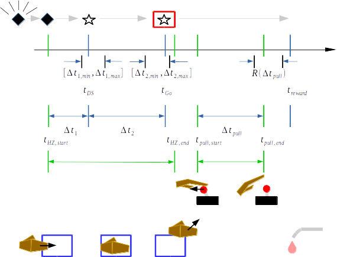

# Joystick Task Trial Sequence

## NHP Interval Timing Task correct trial sequence

Above: the series of animal-initiated events (green vertical markers), task-generated events  (blue vertical markers) and  measured intervals (horizontal arrows) during a correct trial of the interval timing task.  One of several possible discriminative stimuli is shown on the screen at $t_{DS}$; discriminative stimuli are geometric shapes that each code for a particular desired pull duration that the animal will be rewarded for producing later subsequently during the trial.  The animal is cued to start a joystick pull on the appearence of a "Go" cue presented at $t_{Go}$; the Go cue takes the form of a red box that surrounds the discriminative stimulus already present on the screen.

## Negative Reinforcer type 1

When the animal's hand is outside of home-zone, a diamond shape flashes on screen at ~2Hz accompanied by and auditory ‘bell-dinging’ stimulus sounding repeating at ~0.5Hz.  These stimuli continue until animal’s hand enters home-zone.  Relevant parameters in `MonkeyImages_Joystick.py`:

- Graphics files directory link for visual stimuli -> ``

## Task interval $\Delta t_1$ (task-generated)

The time interval spanning entry of hand into home-zone to appearance of the discriminative stimulus.  The duration of $\Delta t_1$ is randomly-drawn from a uniform distribution spanning $[\Delta t_{1,min}, \Delta t_{1,max}]$.  Animal must hold hand in home-zone for full duration of $\Delta t_1$ for the discriminative stimulus to appear.  If hand exits before the $\Delta t_1$ interval completes, the trial ends and the event is timestamped and recorded as a $t_1$-error.  Negative reinforcer type 1 immediately follows early exit occurrence to cue return of hand into home-zone if `EnablePullTimeOut  = True`.

Corresponding parameters in `MonkeyImages_Joystick.py`:

- $\Delta t_1$ -> `DiscrimStimDuration`
- $\Delta t_{1,min}$ -> `DiscrimStimMin`
- $\Delta t_{1,max}$ -> `DiscrimStimMax`

## Task interval $\Delta t_2$ (task-generated)

The time interval spanning appearance of the discriminative stimulus to appearance of the “Go” cue.  The duration of $\Delta t_2$ is randomly-drawn from a uniform distribution spanning $[\Delta t_{2,min}, \Delta t_{2,max}]$.  The Go cue is a red box that appears on screen that surrounds the (already present) discriminative stimulus.  The animal must continue to hold in home-zone for the full duration of $\Delta t_2$ for the Go cue to appear.  If animal's hand exits before interval completes, the trial ends and the event is timestamped and recorded as a $t_2$-error.  Negative reinforcer type 1 immediately follows early exit occurrence to cue return of hand into home-zone.

Corresponding parameters in `MonkeyImages_Joystick.py`:

- $\Delta t_2$ -> `GoCueDuration`
- $\Delta t_{2,min}$ -> `GoCueMin`
- $\Delta t_{2,max}$ -> `GoCueMax`

## Negative reinforcer type 2

To follow pulls of duration outside of the range associated with the discriminative stimulus.  In a negative reinforcement type 2 event, the screen goes dark for a user-specified amount of time, with the option of an auditory "blooper" stimulus that sounds at the onset of the timeout period.

Relevant parameters in `MonkeyImages_Joystick.py`:

- `EarlyPullTimeOut` (user-specified): a Boolean switch for turning on/off occurrence of negative reinforcer type 2 to follow pull events that occur during either $\Delta t_1$ or $\Delta t_2$ intervals.  If `EarlyPullTimeOut` is set to `True`, the current trial ends on an early exit and negative reinforcer type 1 is presented.  If set to `False` the trial continues without interruption.
- `EnableTimeOut` (user-specified): a Boolean switch to enable type 2 negative reinforcement events to follow pull durations that ar outside of rewarded range for the trial.
- `TimeOut` (user-specified): The duration of timeout intervals during type 2 negative reinforcement events.
- `EnableBlooperNoise` (user-specified): a Boolean switch to specify if the "Blooper" sound should play at the start of type 2 timeout periods.

## Joystick pull events

Following Go cue presentation, task monitors for start of joystick pull.  If a pull does not occur within user specified amount of time (`MaxTimeAfterSound`) the trial ends, the absence of pull is recorded as a "no pull" event, the time of elapse is recorded and a new trial begins.  If pull occurs within time limit following Go cue appearance, the time of pull is measured as $\Delta t_{pull} = t_{pull,end} - t_{pull,start}$.  If $\Delta t_{pull}$ falls in the reward range associated with the particular discrimative stimulus on the screen, a food/fluid reward is delivered. If $\Delta t_{pull}$ is outside of the reward range for the trial, no reward is delivered, the trial ends, the times of the erroneous pull are recorded and classified as a "pull failure".  If `EnableTimeOut = True` negative reinforcement type 2 is presented.  If `EnableTimeOut = False` the discriminative stimulus and Go cue remain on screen and the animal may attempt additional pulls for reward until the maximum time for the trial elapses (`MaxTimeAfterSound`).

## Visual stimuli

## Reward